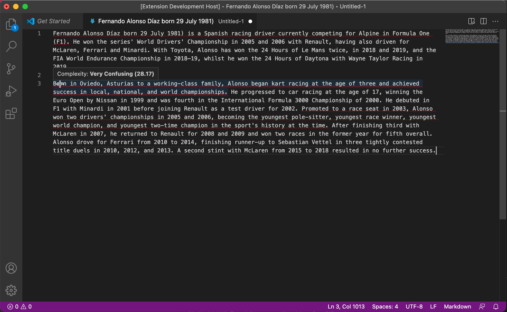

# VS Code English Complexity

This VS Code Extension highlights complex sentences in your english writing. It works on plain text and markdown files. Use shorter words and sentences to make then easier to read.



## Running the Extension

* `npm install` to initialize the project
* `npm run watch` to start the compiler in watch mode
* open this folder in VS Code and press `F5`
* this will open the `[Extension Development Host]` window, running the extension:
  * Open any plain text or markdown files.
  * The extension will highlight senteces with considered complex.
  * You can control the complexity threshold in the user settings, add
    ```
    "englishcomplexity.complexityThreshold": 50
    ```
    to customize the complexity threshold. The lower the number, the more complexity is allowed. See the table below for reference.

| Score |    Difficulty     |
|-------|-------------------|
|90-100 | Very Easy         |
| 80-89 | Easy              |
| 70-79 | Fairly Easy       |
| 60-69 | Standard          |
| 50-59 | Fairly Difficult  |
| 30-49 | Difficult         |
| 0-29  | Very Confusing    |
